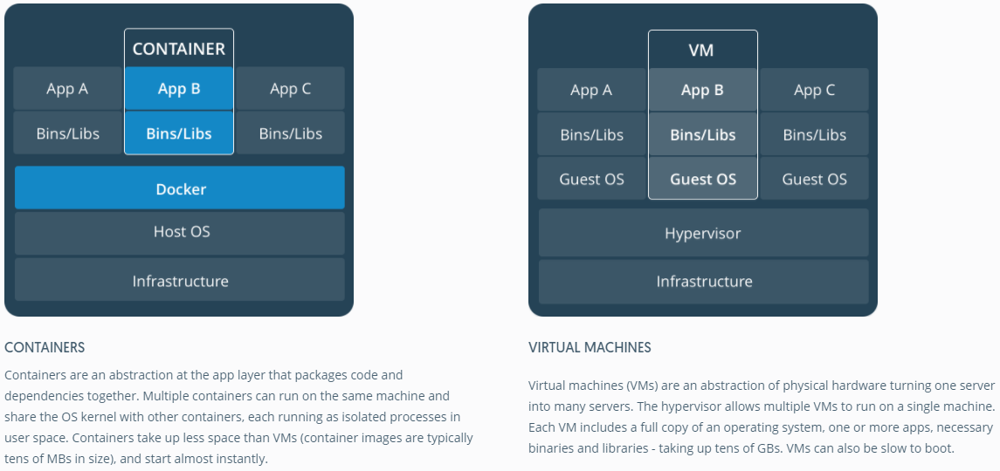

# Hand on intro to docker in vscode

1. [docker in command line](docker_in_cmd.md)
2. [docker in vscode](docker_in_vsc.md)

## Terminology:
- Image: read-only template for instructions to create a docker container. Mostly based on another image
- Container: runnable instance of an image

## VM vs Container

